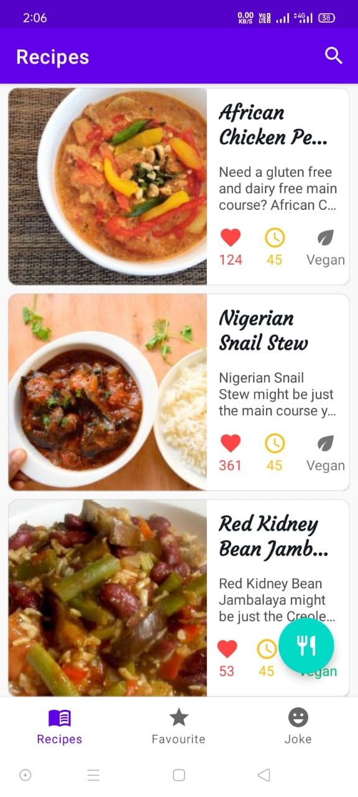
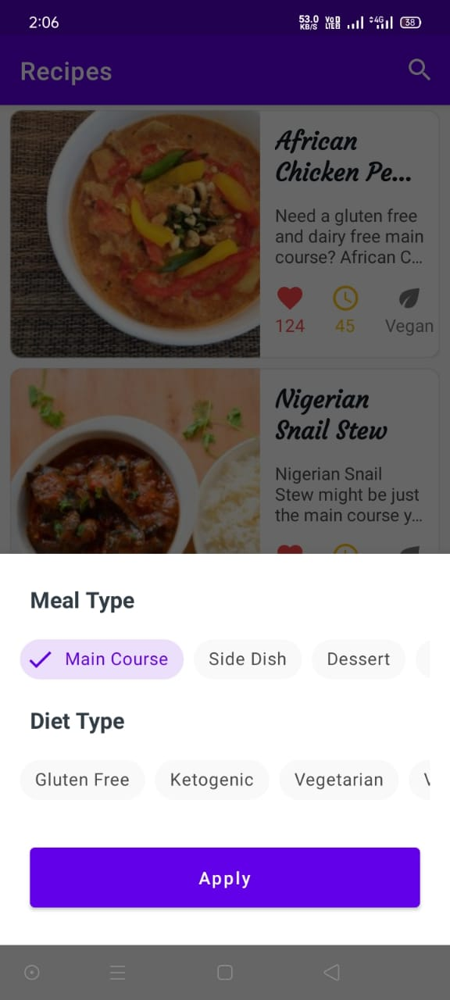
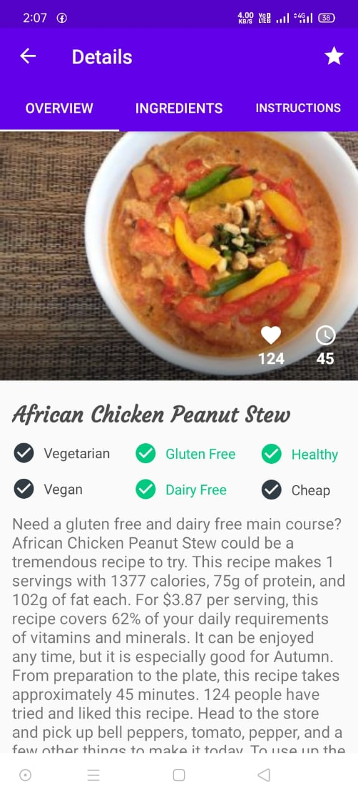
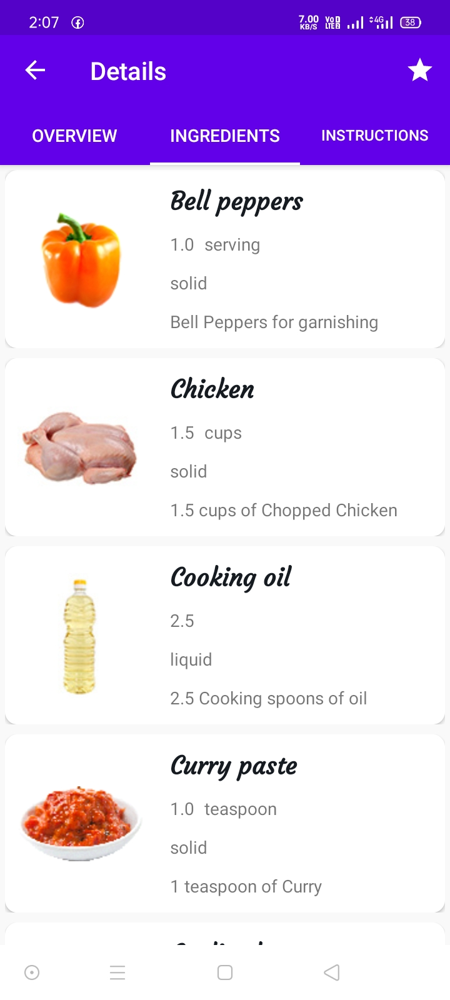
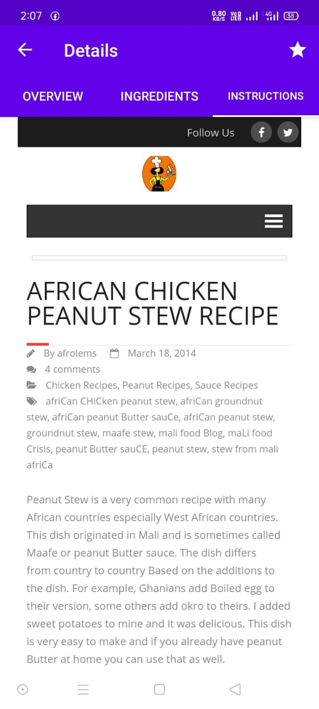
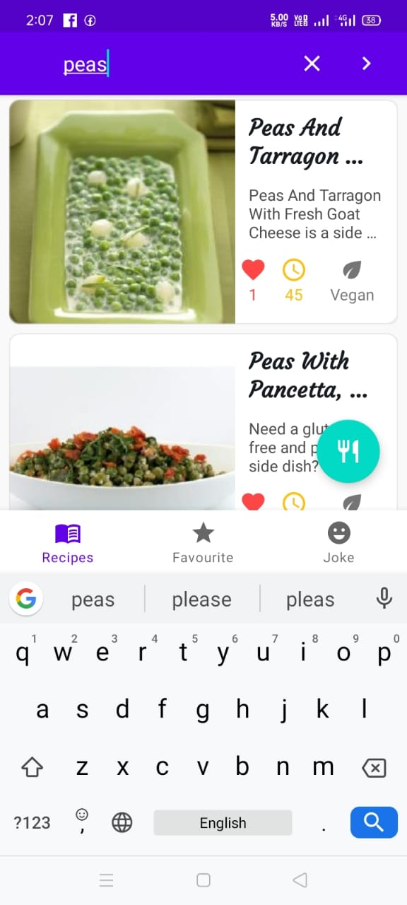

# Foodx

** FoodX ** is an android application 📱 which shows Food Recipes. User can filter them based on Meal-Type and Diet-Type.

# [Android Architecture Components]

- ROOM Database
- Dependency Injection - Dagger-Hilt
- Retrofit
- Offline Cache using Room
- Kotlin Coroutines
- Android Architecture Component
- Navigation Component
- DataStore Preferences
- Data Binding
- ViewModel
- AndroidViewModel
- LiveData
- Flow
- DiffUtil
- Search Recyclerview
- REST API
- Material Design
- Create Shimmer Effect
- Create Modal Bottom Sheet

  ## 📸 Screenshots

||||
|:----------------------------------------:|:-----------------------------------------:|:-----------------------------------------: |
|  |  |  |
|  |  |  |

# Package Structure
    
    com.example.foodx       # Root Package
    .
    ├── adapters                # For adapters of all activities and Fragments.
    ├── bindingadapters                # For binding adapters.
    ├── data                # For data handling.
    |   ├── database           # For Room Database 
    |   └── network      # For Retrofit.
    |
    ├── di                    # Dependency Injection.
    ├── models                # Model data classes.
    ├── ui                    # UI/View layer
    ├── util                  # Utility Classes / Kotlin extensions
    ├── viewmodels            # ViewModels
    |
    │   ├── model             # Model data classes 
    │   └── repository        # Single source of data.
    |
    ├── di                    # Dependency Injection             
    │   └── module            # DI Modules
    ├── ui                    # UI/View layer Activities and Fragments
    |   ├── fragments         # All Fragments
    |       ├── favourite   
    |       ├── foodjoke      
    |       ├── ingredients   
    |       ├── instructions    
    |       └── overview    
    |       └── recipes
    └── utils               # Utility Classes / Kotlin extensions

## Architecture
This app uses [***MVVM (Model View View-Model)***](https://developer.android.com/jetpack/docs/guide#recommended-app-arch) architecture.

 ## Contact
If you need any help, you can connect with me.

Email - knishant362@gmail.com

